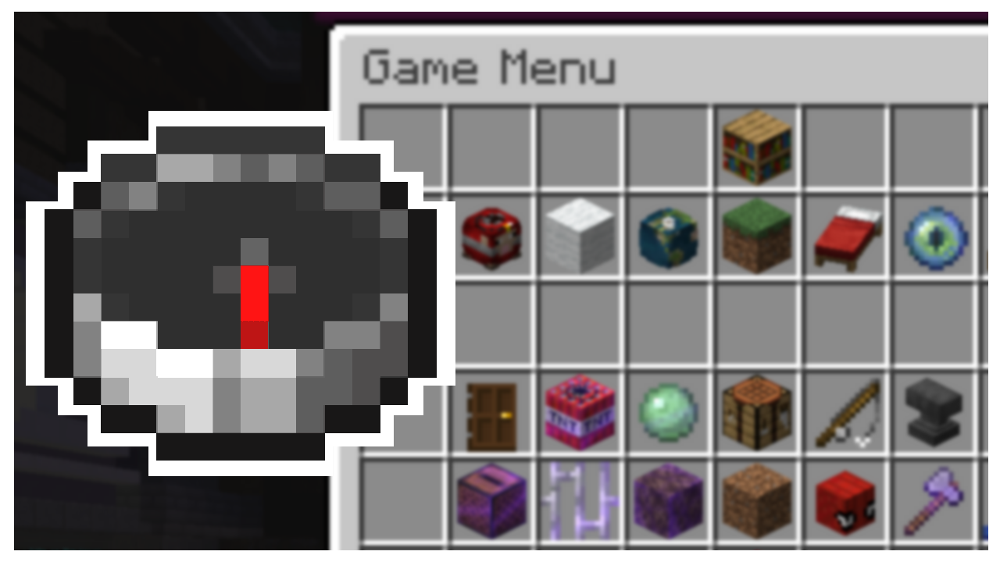

# Minecraft GUI Framework
<!-- ALL-CONTRIBUTORS-BADGE:START - Do not remove or modify this section -->

<!-- ALL-CONTRIBUTORS-BADGE:END -->

## How it Works 💡
<!-- prettier-ignore-start -->
<!-- markdownlint-disable -->
This repo provides example datapacks for coding GUIs using barrels, minecart chests, and ender chests! There are tons and tons of comments provided to help explain what each line of code does, and you can watch the youtube video to get a better idea of what each module / key component is meant to do.  
The resource pack provides you with assets for building your own GUIs to use with the datapacks.
<!-- markdownlint-enable -->
<!-- prettier-ignore-end -->

## How to Use 📝
<!-- prettier-ignore-start -->
<!-- markdownlint-disable -->
The main modifications I suggest is to add / remove pages under functions/ui/refresh in the lines that check for the ui.page score. Those lines simply redirect to the page it is on. Then I suggest adding / removing the folders in the pages folder and forming commands similar to the provided examples, supplying it with logic for what items to return, what items are input / output and what slots are meant to be buttons. The youtube video covers how to do this quite extensively.
<!-- markdownlint-enable -->
<!-- prettier-ignore-end -->

## Contributors 🧱
<!-- prettier-ignore-start -->
<!-- markdownlint-disable -->
<table>
  <tr>
    <td align="center"><a href="https://github.com/CloudWolfYT"> <b>Cloud Wolf</b></a> <a href="#" title="Project Creator">🔨</a></td>
    <td align="center"><a href="https://gist.github.com/misode"> <b>Misode</b></a> <a href="#" title="Invisible Minecarts">💡</a></td>
  </tr>
</table>

<!-- markdownlint-enable -->
<!-- prettier-ignore-end -->
